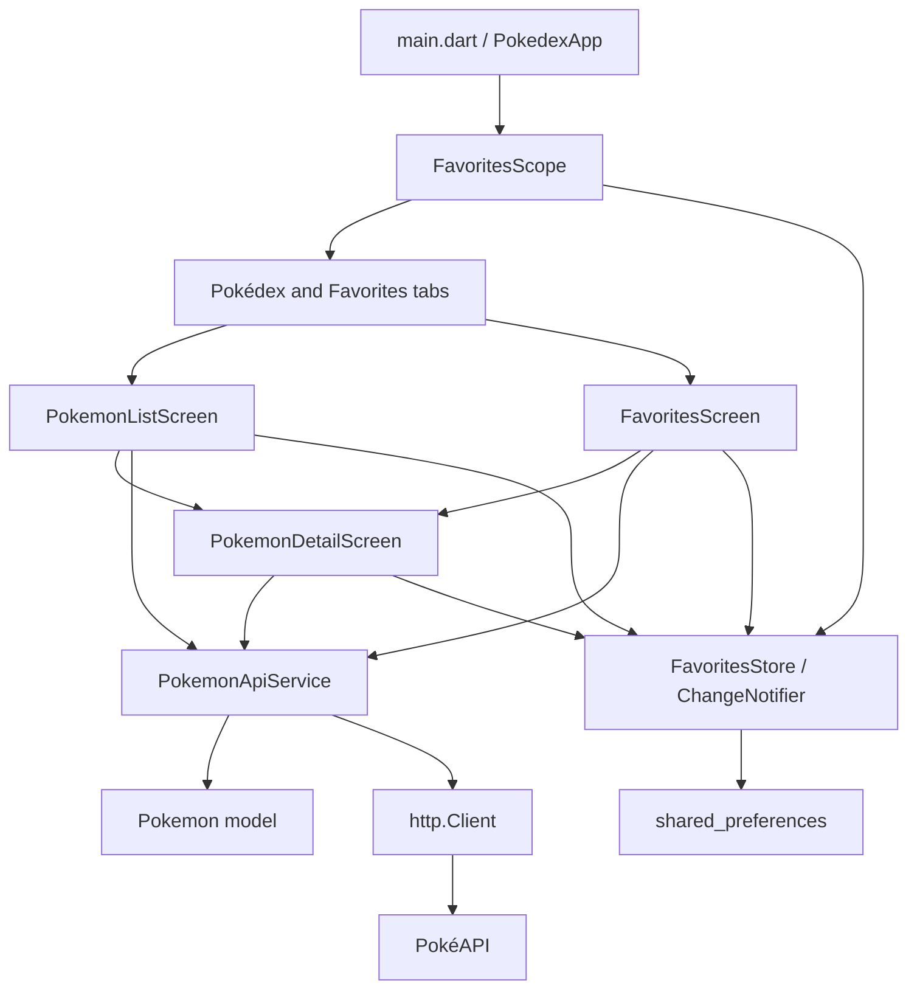

# Project Learning Guide: Flutter Pokédex

This guide explains the code that is currently in this repository. It is a companion to `README.md`: the README helps someone install and run the app, while this guide explains how and why the implementation works.

## 1. Project overview

### What the app does

The app displays Pokémon from PokéAPI. The **Pokédex** tab fetches records in pages of 20, shows them in a grid, and lets the user search the records already loaded. Selecting a Pokémon opens a detail screen. The **Favorites** tab displays saved Pokémon and lets the user open the same detail screen. Favorite IDs are stored on the device.

The app has three kinds of state:

1. **Remote data:** Pokémon list pages and detail objects fetched by `PokemonApiService`.
2. **Screen state:** loading, errors, page offsets, search text, and detail futures held by screen `State` objects.
3. **Shared favorite state:** a `FavoritesStore` instance shared by the screens and backed by `shared_preferences`.

### Flutter and Dart

Flutter is a UI toolkit. A Flutter screen is assembled from widgets, such as text, buttons, layouts, and lists. Dart is the programming language used to write those widgets and the app logic. Flutter and Dart are not separate dependencies in `pubspec.yaml`; installing Flutter provides its matching Dart SDK.

### PokéAPI and the app

PokéAPI is an HTTP service. The app asks it for a page of Pokémon or one Pokémon's details. The response body is JSON text. `PokemonApiService` decodes that text, checks its structure, and asks the `Pokemon` model to validate and extract the fields this UI uses.

### Architecture at a glance



Think of the service as the delivery worker, the model as the form that checks each delivery, the screen as the display, and the FavoritesStore as a shared noticeboard that saves its contents locally.

## 2. Environment and setup

### Tools

- **Flutter SDK:** provides Flutter commands, framework libraries, and the matching Dart SDK.
- **Dart:** the language, formatter, and analyzer used by this project.
- **VS Code:** optional editor. The Flutter and Dart extensions provide code navigation and diagnostics.
- **Chrome:** required for the project's web run command.
- **Android Studio and Android SDK:** needed only for Android emulator/device runs. The Android app declares the Internet permission in `android/app/src/main/AndroidManifest.xml`.
- **Git:** used to inspect and record source changes; it is not needed to launch the app.

In PowerShell, open the project and check the toolchain:

```powershell
Set-Location C:\srcfolder\pokedex_app
flutter doctor
flutter --version
flutter pub get
```

`flutter doctor` reports missing platform tooling. Android users may also need to install an SDK/emulator in Android Studio and accept licenses with `flutter doctor --android-licenses`.

### `pubspec.yaml` and `pubspec.lock`

`pubspec.yaml` is the project's dependency and configuration manifest. This project declares Flutter, `cupertino_icons`, `http`, and `shared_preferences`; test tooling includes `flutter_test` and `flutter_lints`. The declared Dart SDK constraint is `^3.13.4`.

`pubspec.lock` records the concrete dependency versions selected for this application. `flutter pub get` reads the manifest and makes the dependencies available. A lock file helps different machines resolve the same versions. Do not edit it by hand to add a package; use `flutter pub add package_name` when adding a real dependency.

`http` lets the service issue requests and allows tests to inject `MockClient`. `shared_preferences` gives the Favorites adapter persistent key/value storage. The app uses Material widgets and Material icons; `cupertino_icons` is listed as a dependency but there are no direct `CupertinoIcons` imports in the current Dart files.

### Launch locally

```powershell
flutter devices
flutter run -d chrome
```

To launch on an Android emulator or attached device, first start/authorize it, then use the device ID printed by `flutter devices`:

```powershell
flutter devices
flutter run -d <device-id>
```

The app makes live network requests when launched normally. The tests do not depend on live PokéAPI responses because they inject mocked HTTP clients.

## 3. Important files, one by one

### App startup and shared state

#### `lib/main.dart`

**Responsibility:** starts the Flutter app, creates or accepts the shared FavoritesStore, waits for favorite IDs to load, and builds the app shell.

`main()` calls `WidgetsFlutterBinding.ensureInitialized()` and then `runApp(const PokedexApp())`. `PokedexApp` is a `StatefulWidget` because it owns the store lifecycle and selected tab. `_PokedexAppState.initState()` creates the store (unless a test injected one) and starts `loadFavorites()`. Its `FutureBuilder` displays a spinner during startup, an error with a **Try again** action if reading favorites fails, or the app once loading completes.

The successful state wraps `MaterialApp` in `FavoritesScope`, then shows a `Scaffold` with an `IndexedStack` and a bottom `NavigationBar`. The `IndexedStack` preserves each tab's widget state while the user switches tabs. A `MaterialBanner` exposes storage write failures with a **Retry save** action. The app disposes a store it created itself; when a test supplies its own store, that test remains responsible for disposing it.

The file also contains `PokedexHomePlaceholder`, a standalone placeholder widget. `PokedexApp` currently builds the real list/favorites tab shell instead, so the placeholder is not the active home screen.

#### `lib/state/favorites_scope.dart`

**Responsibility:** provides the nearest `FavoritesStore` to descendant widgets without manually passing it through every constructor.

`FavoritesScope` extends Flutter's `InheritedNotifier<FavoritesStore>`. The static `of(context)` method calls `dependOnInheritedWidgetOfExactType`, which registers the caller as a dependent. When the notifier changes, dependent widgets are scheduled to rebuild. If a widget tries to read the scope outside the app's scope, the assertion helps reveal the wiring mistake.

#### `lib/state/favorites_store.dart`

**Responsibility:** owns the one in-memory set of favorite IDs and persists it.

`FavoritesStore` extends `ChangeNotifier`. `favoriteIds` returns an unmodifiable copy; `isFavorite(id)` checks membership. `loadFavorites()` reads a string list under `favorite_pokemon_ids`, parses valid positive integers, marks the store loaded, and notifies listeners. Read errors are allowed to propagate to `PokedexApp` so startup can show a retry state.

`toggleFavorite(id)` validates that the store is alive, the ID is positive, and loading has completed. It updates the set immediately and calls `notifyListeners()` so screens synchronize. It then queues a write through `_pendingWrite`. The write queue prevents overlapping storage writes from finishing out of order. Write failures are caught and kept in `persistenceError`; the in-memory change remains visible and the app banner offers `retryPersistence()`. This is an optimistic UI policy: if the app exits before a retry succeeds, disk can still contain the older set.

`SharedPreferencesFavoritesPreferences` is the production adapter around `SharedPreferencesAsync`. `FavoritesPreferences` is a small interface so tests can provide an in-memory fake instead of platform storage.

### Data model and API

#### `lib/models/pokemon.dart`

**Responsibility:** represents the fields displayed by the app and parses both list-result and detail JSON shapes.

The `Pokemon` object stores `id`, `name`, and `url`, plus optional `imageUrl`, `height`, and `weight`, and collections for `types`, `abilities`, and `stats`.

- `Pokemon.fromApiResult` reads the list endpoint's `name` and `url`. It requires a nonempty name, an absolute URL, and a positive numeric ID at the end of the URL path.
- `Pokemon.fromDetails` requires a positive integer `id` and nonempty `name`. It reads height/weight as nonnegative integers, names nested inside types and abilities, each base-stat number and stat name, and image fields from `sprites`.
- Missing optional measurements remain `null`, so the UI can label them unknown or omit a measurement row. Missing optional lists become empty lists, and missing images remain null so the detail UI can use a sprite URL fallback.
- A non-null field with the wrong type, or an incomplete nested entry, raises a `FormatException` with context. This avoids silently presenting malformed data as if it were complete.

The parser only extracts the fields consumed by this app; it is not a complete Dart representation of every PokéAPI field.

#### `lib/services/pokemon_api_service.dart`

**Responsibility:** builds request URLs, sends HTTP requests, checks response status, decodes JSON, and delegates to model parsing.

`PokemonApiService` accepts an optional `http.Client` and request timeout. Production screens create their service through an optional `apiServiceFactory` or use the default client. Tests pass an `http.testing.MockClient`. Each owning screen disposes its service in `dispose()`.

- `fetchPokemonPage(limit, offset)` validates pagination values, calls the list endpoint, checks for HTTP 200, requires a JSON object with a `results` list, checks each row is an object, and parses it with `Pokemon.fromApiResult`.
- `fetchPokemonDetails(nameOrId)` trims and lowercases the key, calls the detail endpoint, gives 404 a not-found `PokemonApiException`, checks other non-200 responses, requires an object, and calls `Pokemon.fromDetails`.
- `_get` applies the 15-second default timeout. A timed-out wait becomes `PokemonApiTimeoutException`; HTTP errors are `PokemonApiException` instances with a status code. Malformed JSON and wrong response shapes use `FormatException`.
- `dispose()` closes the owned client.

The service does not catch network failures and convert them to successful empty data. That lets screens show retry/error states. The `Future.timeout` wrapper stops waiting but does not cancel an already-started request at the `http.Client` level.

### Screens

#### `lib/screens/pokemon_list_screen.dart`

**Responsibility:** loads and displays Pokémon pages, performs local search, toggles list favorites, and navigates to details.

The `StatefulWidget` accepts `apiServiceFactory` for dependency injection. `_PokemonListScreenState` owns the service, loaded list, search controller, `_offset`, `_isLoading`, `_hasError`, and `_hasMore`. `initState()` requests the first page. `_loadPokemon()` exits if a request is already running or pagination has ended. After success it appends only IDs not already present, advances `_offset` by the number of returned API rows, and decides whether another page may exist based on page length. The `mounted` checks prevent calling `setState` after the screen is removed. Later-page errors keep existing records and expose a retry button.

`_filteredPokemon` trims and lowercases the query, then uses `contains` on each loaded name. An empty query returns the loaded list. It does not search the whole API; the help text and no-match message explain that more pages may need to be loaded. A `TextEditingController` tracks the input and is disposed with the screen.

`GridView.builder` creates visible cards lazily. Card taps push `PokemonDetailScreen` with the selected `Pokemon`; the favorite icon calls the shared store. Each list image has an `errorBuilder` fallback icon.

#### `lib/screens/pokemon_detail_screen.dart`

**Responsibility:** fetches one Pokémon's detail object and renders the available fields.

The screen receives the selected list/favorite `Pokemon`, then requests the detail endpoint using its ID in `initState()`. `FutureBuilder<Pokemon>` shows a spinner until the future completes, a user-facing error and **Try again** action on failure, or the details on success. Retry replaces `_details` inside a synchronous `setState` callback. `dispose()` closes the screen-owned service.

On success, the screen displays ID/name, image with a fallback, a favorite control connected to `FavoritesScope`, type chips, available measurements, abilities, and stats with progress indicators. Empty optional lists simply mean those sections are omitted. The Favorites button updates the shared store, not a detail-only copy.

#### `lib/screens/favorites_screen.dart`

**Responsibility:** observes shared favorite IDs, fetches detail records for them, and displays an up-to-date favorite list.

In `didChangeDependencies()`, the screen gets `FavoritesStore`, subscribes to it, and removes any prior subscription if the store instance changes. `_syncFavorites()` compares the current ID set with `_requestedIds`. If IDs changed, it starts a new load; a request version ensures an old response cannot replace a newer favorite selection. Empty IDs immediately show the empty state without making requests.

`_loadFavorites()` fetches details for uncached IDs concurrently with `Future.wait` and retains successful details in `_pokemonById`. On failure it records `_loadError` and displays a **Try again** action rather than pretending there are no favorites. Removing an item calls `toggleFavorite`; the listener then synchronizes the UI. `dispose()` unregisters the listener and closes a service if one was created.

### Tests and configuration

#### `test/pokemon_test.dart`

Unit tests for list and detail parsing: valid IDs and fields, required-field validation, missing optional fields, and malformed optional shapes. They call model factories directly, so they are fast and do not need widgets or HTTP.

#### `test/pokemon_api_service_test.dart`

Service tests inject `MockClient` handlers that return controlled HTTP responses. They check valid list/detail requests, request URLs and query parameters, list HTTP errors, detail 404, malformed JSON, wrong response structures and row types, timeout distinction, and invalid pagination/timeout values. The timeout test uses a `Completer` to hold a fake response open, then confirms the service returns its timeout exception without contacting the live API.

#### `test/pokemon_list_screen_test.dart`

Widget tests mount the actual list screen with a fake preferences adapter and a `MockClient`. They check case-insensitive trimmed substring search, empty/whitespace search, a later page becoming searchable, the local-search no-match explanation, offsets, an empty result ending pagination, duplicate IDs, page retry preserving loaded rows, and repeated load-more taps not creating overlapping requests.

#### `test/pokemon_detail_screen_test.dart`

Mounts the actual detail screen with a fake store and a mocked service. Its one test observes the initial spinner, returns an HTTP error, taps **Try again**, then returns valid details and checks the displayed ID/name/type. This test also guards against invalid asynchronous work inside `setState`.

#### `test/favorites_store_test.dart`

Tests loading IDs, adding/removing, invalid IDs, persistence failure followed by retry, and serializing overlapping writes. Its fake preferences use a map and can deliberately fail or delay a write.

#### `test/favorites_screen_test.dart`

Tests synchronization from list and detail interactions, Favorites API failure/retry, concurrent detail loads, and the app-level persistence failure/retry banner. It uses fake preferences and `MockClient`; no live requests are needed.

#### `test/widget_test.dart`

Checks that the app home header appears, tapping a list Pokémon opens its matching detail, and tapping a Favorites item opens its matching detail. The tests assert detail content such as the ID, name, type, and ability.

#### Other configuration

- `analysis_options.yaml` includes the recommended `flutter_lints` rules and excludes generated/build and platform directories from Dart analysis.
- `android/app/src/main/AndroidManifest.xml` requests Android Internet access.
- `pubspec.yaml` declares SDK constraints, packages, and Flutter Material icon support.

## 4. Flutter and Dart fundamentals in this code

### `main()` and `runApp()`

`main()` is Dart's program entry point. `runApp(widget)` hands the root widget tree to Flutter, which lays it out and draws it. Here the root is `PokedexApp`.

### Widgets and the widget tree

A widget is an immutable description of UI. Flutter nests descriptions into a tree. For example, `MaterialApp` contains a `Scaffold`; the `Scaffold` contains an `AppBar`, body, and bottom navigation. Flutter compares updated widget descriptions and updates the rendered interface.

### `StatelessWidget` and `StatefulWidget`

A `StatelessWidget` has no mutable state of its own. The placeholder in `main.dart` is stateless. `PokedexApp`, the screens, and the detail screen are stateful because they change tabs, hold fetched records, or represent loading/error state. A `StatefulWidget` is the immutable configuration; its associated `State` object stores values that change over time.

### `build()`, `BuildContext`, and `setState()`

`build(context)` describes the widgets for the current state. `BuildContext` identifies the widget's position in the tree and is used to find things such as a `FavoritesScope`, theme, or navigator. It is not a global app object.

`setState(() { ... })` changes a state object's values synchronously and tells Flutter to rebuild that part of the tree. Do not put an `async` callback or a Future-returning assignment expression in it. Start asynchronous work separately, then call `setState` only to update synchronous state. The detail retry test caught exactly this class of error.

### Common layout widgets

- `MaterialApp` supplies navigation, theme, and Material design behavior.
- `Scaffold` provides common screen regions such as app bar, body, and bottom bar.
- `Column` stacks children vertically; `Row` places them horizontally.
- `ListView.builder` and `GridView.builder` build scrolling rows/cards on demand. This avoids constructing every item in a long collection at once.
- The list screen uses `GridView.builder`; Favorites uses `ListView.builder`.
- `IndexedStack` shows one tab while keeping the other tab's widget state alive.

### Classes, constructors, fields, and methods

`Pokemon` is a class; a parsed `Pokemon` is an object. Fields such as `name` hold values. Constructors create objects, and methods/functions such as `isFavorite` or `fetchPokemonPage` perform work. Named required constructor arguments make object creation explicit:

```dart
const Pokemon(id: 25, name: 'pikachu', url: 'https://example.test/25');
```

The app usually spells out types (`Future<Pokemon>`, `List<String>`) so intent is visible while learning.

### `final`, `const`, and null safety

`final` means a variable is assigned once. `const` means a compile-time constant object/value where possible. Null safety separates values that can be absent from values that must exist. For example, `height` is `int?` because a missing API measurement is represented as null; `id` is `int` because a valid model must have one.

Avoid force-unwrapping with `!` unless a preceding condition proves the value exists. The detail screen uses `snapshot.data!` only after checking `snapshot.hasData`.

### `Future`, `async`, and `await`

A `Future<T>` represents a value that may arrive later. `async` allows a function to use `await`; `await` pauses that function while the event loop continues handling UI work. Network and preferences APIs return futures.

```dart
final response = await client.get(uri);
```

If a future throws, the `await` throws too. The service allows request/parsing failures to reach the screen, where a `FutureBuilder` or `try/catch` can display an error.

### HTTP, status codes, JSON, and exceptions

An HTTP request has a URL and receives a status code and body. A 200 response is expected for these PokéAPI GET calls; 404 means a requested detail was not found. `jsonDecode` converts JSON text into Dart maps/lists. The model validates types and required fields before using them.

The service uses `PokemonApiException` for HTTP failures and includes the status code, `PokemonApiTimeoutException` for request timeouts, and `FormatException` for malformed JSON or unexpected data. A screen should show a useful error and retry option instead of converting a failure into an empty successful result.

### `ChangeNotifier`, `notifyListeners()`, and `InheritedNotifier`

`ChangeNotifier` stores shared mutable state and lets listeners subscribe. `FavoritesStore` calls `notifyListeners()` immediately after it changes its ID set. `FavoritesScope` is an `InheritedNotifier<FavoritesStore>`: it makes the store discoverable in descendants and connects notifier changes to Flutter rebuilds. This lets the list, detail, and Favorites screens agree about favorite state without each owning a duplicate set.

### Local persistence and dependency injection

`SharedPreferencesAsync` stores the favorite IDs between launches. The store converts IDs to strings when saving because its storage interface uses a string list. `FavoritesPreferences` is an abstraction, and its production implementation delegates to shared preferences. Tests inject a fake implementation backed by a Dart map.

Dependency injection means passing a dependency into an object instead of constructing a hidden global dependency. Screens accept `apiServiceFactory`, and the store accepts `FavoritesPreferences`. This makes tests deterministic and makes ownership clearer.

### Lifecycle, `initState()`, `dispose()`, and `mounted`

`initState()` runs when a `State` object is first inserted. The list starts its first request there; the detail screen creates its details future there. `dispose()` runs when the object is permanently removed. Screens dispose their controllers/services and Favorites removes its notifier listener.

Network work can finish after a screen has been removed. Before calling `setState` after an `await`, check `mounted`. Favorites also uses request versions because a widget can remain mounted while the favorite selection changes; mounted alone does not protect against stale responses.

### Navigation and passing data

Bottom navigation changes the selected child in `IndexedStack`. For a selected Pokémon, `Navigator.push(MaterialPageRoute(...))` places `PokemonDetailScreen` over the current route. The chosen `Pokemon` is passed into its constructor; the detail screen then fetches the full record using that object's ID. This passes only the context needed to identify the detail request.

### Mocks, fakes, and test types

- A **mock HTTP client** (`MockClient`) returns a programmed response for each request. Tests control status codes, JSON, and delays without the network.
- A **fake preferences adapter** behaves like a tiny local store, but runs in memory. It can fail or pause writes to exercise edge cases.
- **Unit tests** call model/store/service methods directly.
- **Widget tests** pump a Flutter tree, tap controls, enter text, and assert what the user sees.

Deterministic tests make failures repeatable. If a unit/widget test unexpectedly needs internet, check that the relevant screen received the test's `apiServiceFactory` and that every API path is handled by its `MockClient`.

## 5. End-to-end data flows

### Load the first list page

1. `PokedexApp` waits for `FavoritesStore.loadFavorites()` before showing the tabs.
2. `PokemonListScreen.initState()` starts `_loadPokemon()`.
3. `_loadPokemon()` sets `_isLoading`, then calls `fetchPokemonPage(limit: 20, offset: 0)`.
4. The service performs GET, checks status, decodes JSON, checks `results`, then parses each result with `Pokemon.fromApiResult`.
5. The list screen adds new IDs, advances the offset by rows received, computes `_hasMore`, and rebuilds.
6. If a failure occurs, the list's error state keeps current records (if any) and exposes retry.

```text
List State -> PokemonApiService -> HTTP GET -> JSON checks -> Pokemon objects
     ^                                                        |
     +---------------------- setState/rebuild ----------------+
```

### Search and pagination

As the user types, `TextField.onChanged` calls `setState`. `_filteredPokemon` trims the query, lowercases it, and selects loaded names containing the query. Empty/whitespace input returns every loaded Pokémon. Search never makes an API request.

The **Load More** button calls `_loadPokemon()` using the current offset. `_isLoading` blocks concurrent calls; `_hasMore` blocks calls after a short/empty page. After a later-page failure, offset stays unchanged, existing records stay in `_pokemon`, and **Retry loading more** requests that same page again. Returned IDs are checked against IDs already in the list so overlapping pages do not duplicate cards.

### Open details

1. Tapping a list card or favorite row calls `Navigator.push`.
2. It passes the selected `Pokemon` to `PokemonDetailScreen`.
3. `initState()` requests `/pokemon/{id}`.
4. `PokemonApiService` checks status and JSON structure and parses fields via `Pokemon.fromDetails`.
5. `FutureBuilder` shows spinner, retryable error, or details. Optional missing sections are omitted; a missing artwork URL uses the list sprite URL fallback.

### Add/remove favorite and synchronize screens

1. A screen gets the same store using `FavoritesScope.of(context)`.
2. Its button calls `toggleFavorite(id)`.
3. The store changes its ID set and immediately notifies listeners.
4. List widgets that depend on the scope rebuild; `FavoritesScreen`'s listener compares favorite IDs and loads or removes detail entries accordingly.
5. The detail screen's favorite icon reads the same `isFavorite(id)` value, so it shows the new state.

```text
List/Detail button -> FavoritesStore Set<int> -> notifyListeners
                                        |             |
                                  save IDs      Favorites listener
                                        |             |
                                 preferences     reload visible rows
```

### Save and restore favorites

On launch, `PokedexApp` awaits `loadFavorites()`. The store reads the saved string list, filters values that are not positive integer IDs, and notifies listeners after loading. When a user toggles a favorite, the state changes immediately and a serialized write saves the latest set. A failed write is retained as `persistenceError` and shown by the app banner. **Retry save** queues another write of the current set. If the user closes the app before retry succeeds, the change may not survive the restart.

### Network and storage errors

- Service HTTP errors include a status code; a detail 404 explains the requested Pokémon was not found.
- Invalid JSON/shape becomes a parsing error rather than an empty list.
- A request taking longer than the configured timeout raises a distinct timeout exception.
- The list uses its own error flags and retry actions. Detail uses `FutureBuilder.hasError`. Favorites records a load error and offers retry.
- Favorite storage reads can fail during startup; the app shows a retry screen. Favorite writes are caught by the store, visible in a banner, and retryable.
- `Future.timeout` does not abort the underlying request. It only stops waiting for the result.

## 6. Development commands and workflow

Run these from PowerShell after `Set-Location C:\srcfolder\pokedex_app`:

| Command | Purpose | What success/failure means |
| --- | --- | --- |
| `flutter doctor` | Checks Flutter and platform tooling | Lists ready/missing toolchains; a warning may only affect one target |
| `flutter --version` | Shows installed Flutter/Dart versions | Helps compare with SDK constraints or reproduce environment issues |
| `flutter pub get` | Resolves packages from `pubspec.yaml` | Success downloads/locates dependencies; network/constraint errors need attention |
| `flutter pub add package_name` | Adds a package and updates package files | Use only when code needs a new dependency; not used by this project at runtime |
| `flutter devices` | Lists available targets | Chrome/emulator/device must appear before selecting it |
| `flutter run -d chrome` | Builds and launches in Chrome | Starts the app; network features need internet |
| `dart format .` | Formats Dart source files | Reports formatted file count; formatting is not a correctness test |
| `flutter analyze` | Static analysis/lints | “No issues found” means no detected analyzer issues, not that every runtime path is correct |
| `flutter test` | Runs all unit and widget tests | A failing expectation/exception indicates a code or test issue |
| `flutter test --concurrency=1` | Runs test files one at a time | Slower, but can make shared-resource/debugging problems easier to diagnose |
| `git status` | Shows modified/untracked files | Review this before/after a change so unrelated work stays visible |
| `git diff` | Shows tracked-file changes | Read it before staging; untracked files need opening separately |
| `git add <path>` | Stages chosen files for a commit | Staging does not commit; review staged diff first |
| `git commit -m "message"` | Records staged changes in Git history | Only the staged content is included |

These are different actions:

1. **Save** writes editor contents to disk.
2. **Format** changes code layout to the formatter's style.
3. **Analyze** checks static types and lint rules without launching the app.
4. **Test** executes automated test code with controlled dependencies.
5. **Run** launches the app on a selected device/browser.
6. **Commit** records staged changes; it does not run tests automatically unless configured.

## 7. Testing guide and recorded outcomes

Use the mocks and fakes to isolate logic. A `MockClient` makes each HTTP result deterministic; the fake preferences adapter avoids platform channels and permits deliberate storage failures. Widget tests use `WidgetTester` to interact with actual screens. When a widget test fails, read the first exception and the line named in the failure. For a spinner that never ends, check whether the fake response completed and whether its path/offset handler matches the actual request.

The most useful regression tests for this app are:

- model tests for malformed required/nested values;
- service tests for status, JSON shape, and timeouts;
- list tests for search scope, offset progression, deduplication, and retry;
- detail test for loading/error/retry/success;
- store tests for write ordering and recovery;
- Favorites tests for changes made in another screen and stale/failing detail loads.

The last recorded full verification before this documentation-only phase reported `flutter analyze` with no issues and 39 tests passing. Those checks were not rerun while writing this guide; run them locally to verify the current checkout.

## 8. Common bugs and how to diagnose them

- **A screen never leaves its spinner:** inspect the future source and fake response path. Ensure errors are represented in state and that the future eventually completes.
- **A widget test unexpectedly makes a live request:** inject `apiServiceFactory` everywhere the screen creates a service; cover both list and detail URLs in the mock handler.
- **`setState() callback argument returned a Future`:** the callback must be synchronous. Start the Future, assign it inside a normal `setState(() { ...; })`, and do not use an expression-bodied assignment that returns the Future.
- **`setState() called after dispose`:** after `await`, check `mounted` before updating UI. Also dispose owned controllers and services and remove notifier listeners.
- **Favorites tab is stale:** confirm all screens use the same `FavoritesStore` from `FavoritesScope`; do not make a second per-screen favorite set. Confirm the listener is removed in `dispose`.
- **Repeated requests:** guard list loading with `_isLoading`; in Favorites use the current ID set/request version. Don't update offsets on a failed request.
- **Duplicate cards:** compare IDs before appending page results. Advance offsets by returned rows, not only newly displayed rows.
- **A parsing bug becomes an empty-state bug:** don't catch malformed JSON and return an empty list. Preserve an exception so the screen can show retry.
- **A favorite disappears after restart:** check the app-level persistence banner and retry write; local UI state can be ahead of disk after a write failure.
- **Image does not load but details do:** image hosting is separate from PokéAPI data. The `errorBuilder` displays a fallback icon; inspect the image URL/network independently.

## 9. Interview preparation

### Explain this project in about 60–90 seconds

“I built a Flutter Pokédex with a paginated Pokémon list, local search over loaded records, a detail screen, and a Favorites tab. The UI is divided into screens, a `Pokemon` model, and a `PokemonApiService` that performs HTTP requests and validates JSON. The list tracks its page offset and prevents overlapping requests and duplicate IDs. Favorites use a shared `ChangeNotifier` store exposed through `InheritedNotifier`, so changes are immediately visible across screens and persisted as IDs with `shared_preferences`. Network and storage failures have loading/error/retry UI. I test parsing and request behavior with unit tests, `MockClient` responses, and fake preferences, and use widget tests for navigation, synchronization, search, pagination, and retry behavior.”

### Questions and answers

1. **Why separate the API service from the screen?** The service owns request construction, status handling, JSON decoding, and model creation. This keeps widgets focused on presentation and makes HTTP behavior easy to test with a mock client.
2. **What does `Pokemon.fromApiResult` parse?** The list API's `name` and `url`; it validates them and extracts the positive numeric ID from the URL path.
3. **Why is there a second model factory?** List rows contain only summary fields, while details contain measurements, types, abilities, stats, and sprites. `fromDetails` validates that different payload shape.
4. **How does search work?** It trims/lowercases the query and checks whether each loaded name contains it. It makes no network request and only covers already loaded pages.
5. **How does pagination avoid overlap?** `_loadPokemon` returns if `_isLoading` is already true. It uses `_offset`, updated after a successful page response.
6. **Why advance by response row count when deduplicating?** The server offset counts API rows. The display list may add fewer unique IDs, but the next request must still skip all returned rows.
7. **How does the app handle an empty last page?** A page shorter than the requested page size sets `_hasMore` false, so the load-more control disappears.
8. **How are HTTP failures represented?** `PokemonApiException` contains a message and optional status code; detail 404 has a specific not-found message.
9. **What is `PokemonApiTimeoutException` for?** It distinguishes a request that exceeded the configured wait from a response with a failing HTTP status.
10. **Does the timeout cancel HTTP work?** No. `Future.timeout` stops waiting for the future; the `http.Client` request may still finish in the background.
11. **Why throw on malformed JSON?** Returning an empty list would confuse a server/parsing failure with a valid empty result. Throwing lets the screen present an error and retry.
12. **Which model fields are optional?** Measurements, types, abilities, stats, and artwork can be absent and use null/empty values. Core identity fields (`id`, `name`, and list `url`) are required.
13. **How is shared favorite state delivered?** `FavoritesStore` extends `ChangeNotifier`; `FavoritesScope` extends `InheritedNotifier` and provides it to widgets.
14. **Why does the store notify immediately before saving?** The app uses optimistic UI: the interface reacts immediately. Save failures are separately surfaced with an error banner and retry action.
15. **How are overlapping preference writes ordered?** `_pendingWrite` chains writes so an older slower operation cannot overwrite a newer set after it finishes late.
16. **How does Favorites stay synchronized?** It listens to the store. When IDs change, it fetches missing detail models, caches successful models by ID, and ignores responses from obsolete request versions.
17. **Why use `mounted`?** A request can complete after a widget is removed. `mounted` ensures a state object is still in the tree before calling `setState`.
18. **Why use `dispose()`?** It releases owned resources: the list's text controller, HTTP services, and Favorites notifier subscription.
19. **What is dependency injection here?** Widgets accept an API-service factory, and the store accepts a preferences interface. Production supplies real implementations; tests supply mocks/fakes.
20. **How do model/service tests avoid the internet?** They pass `MockClient` handlers that return predetermined responses and assert request URLs and outcomes.
21. **What is the difference between a fake and a mock in this code?** The fake preferences adapter behaves like a small in-memory implementation. `MockClient` is programmed per test to return specific HTTP responses.
22. **What does a widget test verify?** It builds actual widgets, simulates user actions, and checks rendered UI/state transitions, rather than only testing a helper method.
23. **How does a detail request get its Pokémon ID?** The list/Favorites route passes the selected `Pokemon` to the detail screen, which requests details using `pokemon.id`.
24. **What are current limitations?** Search is local to loaded pages, details are not cached offline, images/data need network access, and a timed-out HTTP request is not cancelled.

## 10. Learning checklist and exercises

Try to explain these without reading the code first:

- [ ] Trace `main()` through `PokedexApp` to the first list request.
- [ ] Explain why `Pokemon` has separate list and detail parsers.
- [ ] Describe how a `Future` changes the list/detail UI from loading to success or error.
- [ ] Show where search reads text and why search results are limited to loaded records.
- [ ] Calculate the offset after two full pages and explain what happens after a short page.
- [ ] Explain the ID set used to avoid duplicate cards.
- [ ] Draw how `FavoritesScope` provides one store to the list, detail, and Favorites screens.
- [ ] Describe the optimistic toggle and what the persistence banner means after failure.
- [ ] Explain how a stale Favorites response is prevented from replacing current data.
- [ ] Point out which objects each screen disposes and why.
- [ ] Explain how a `MockClient` test simulates a 500 response or a delayed response.
- [ ] Describe one likely failure at the model, service, screen, and persistence layers.

### Practice exercises

1. Change a mock list response to contain a malformed result row. Predict which exception appears and which screen state handles it.
2. Add a favorite, switch tabs, and explain why the displayed favorite updates without recreating the store.
3. Make a fake preference write fail. Trace the change from the button tap to the banner, then retry and inspect the fake's stored ID list.
4. Add a new optional detail field only if the API model and UI both need it. Write a model test before rendering it.
5. Simulate a first-page error in the list widget test and describe how retry calls the same offset.
6. Explain why a no-match search result does not prove that no Pokémon anywhere in PokéAPI matches.

## 11. Scope and limitations to remember

This guide describes the current implementation, not a production service guarantee. Pokémon search is only over loaded pages; pagination is manual. Favorite IDs persist, but favorite detail data is fetched from the network and is not stored offline. The app uses remote sprites and relies on external service availability. A preference write failure can leave disk behind the visible in-memory state until retry succeeds. A timeout does not abort the underlying HTTP operation. Tests use mocked responses, so they verify app behavior against the supplied fixtures rather than the availability of PokéAPI itself.
