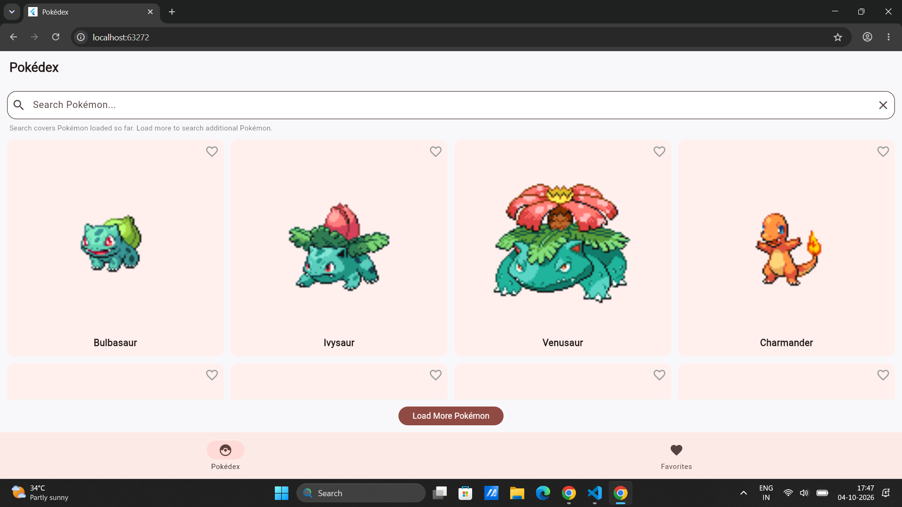
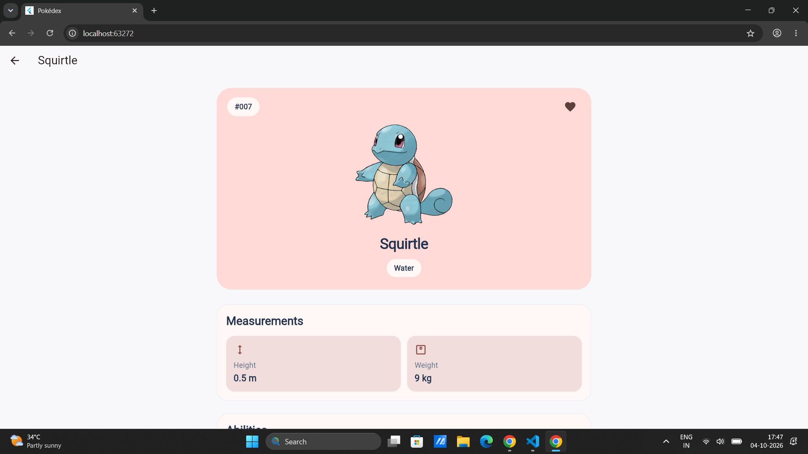
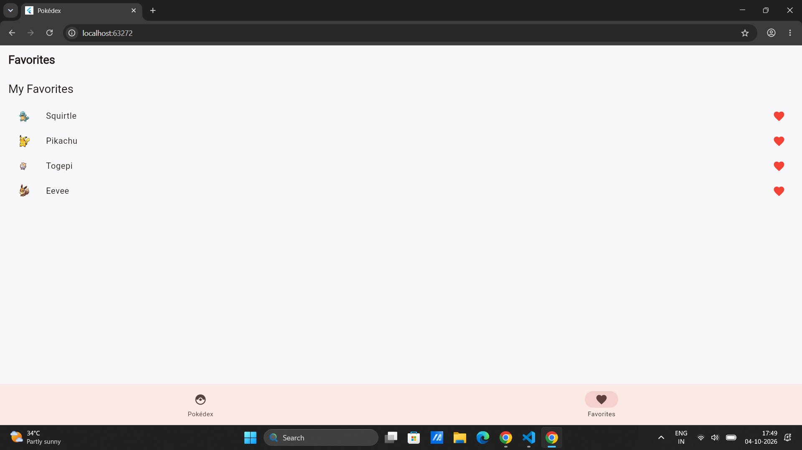
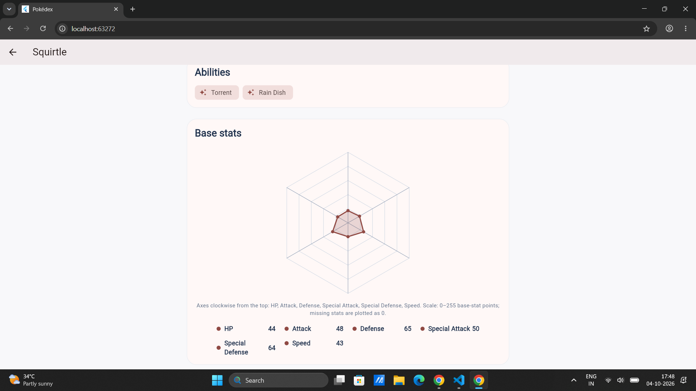

# Pokémon Pokédex

A cross-platform Pokédex built with **Flutter and Dart** that lets you explore Pokémon, view detailed stats, search the Pokémon you've loaded, and save your favorites locally.

Powered by [PokéAPI](https://pokeapi.co/), this project demonstrates API integration, JSON parsing, state management, local persistence, responsive UI design, and automated testing.

## Screenshots

### Pokémon Explorer

Browse Pokémon with artwork, names, search, and pagination.



### Pokémon Details

Explore Pokémon artwork, types, height, weight, abilities, and base stats.



### Favorites

View your saved Pokémon and access their detail screens.



### Pokémon Stats

Visualize a Pokémon's base stats using the stats chart.



## Features

* **Pokémon explorer:** Browse Pokémon in pages of 20.
* **Search:** Search case-insensitively by part of a Pokémon's name among records already loaded.
* **Detailed profiles:** View Pokémon IDs, artwork, types, measurements, abilities, and available base stats.
* **Favorites:** Add or remove favorites from the list, details, and Favorites screens.
* **Shared state:** Keep favorite changes synchronized across screens using a shared favorites store.
* **Local persistence:** Save favorite Pokémon IDs using `shared_preferences` and restore them on startup.
* **Error handling:** Display loading, empty, and retryable error states.
* **Responsive interface:** Adapt the Pokémon grid and detail layout to available screen width.
* **Automated tests:** Test models, API behavior, favorites persistence, and widgets.

## Tech Stack

| Technology           | Purpose                           |
| -------------------- | --------------------------------- |
| Flutter              | Cross-platform UI framework       |
| Dart                 | Application logic and data models |
| PokéAPI              | Pokémon list and detail data      |
| `http`               | HTTP requests and API integration |
| `shared_preferences` | Local favorites persistence       |
| `flutter_test`       | Unit and widget testing           |
| `flutter_lints`      | Static-analysis rules             |

## Getting Started

### Prerequisites

* Flutter SDK and Dart.
* Visual Studio Code with the Flutter and Dart extensions (recommended).
* Google Chrome for running the web version.
* For Android: Android SDK, platform tools, and an emulator or connected device.
* Internet access to retrieve Pokémon data and remote artwork.

### Installation

Clone the repository:

```bash
git clone https://github.com/renusri1612/pokedex_app.git
cd pokedex_app
```

Install dependencies:

```bash
flutter doctor
flutter pub get
```

If you are setting up Android development for the first time, follow the Flutter Android setup guide and accept the Android SDK licenses if prompted.

### Run the App

**Web — Chrome**

```bash
flutter devices
flutter run -d chrome
```

**Android**

Start an emulator or connect an authorized Android device, then run:

```bash
flutter devices
flutter run -d <device-id>
```

Replace `<device-id>` with the device ID reported by `flutter devices`.

## Running Tests

Format the Dart code:

```bash
dart format .
```

Run static analysis:

```bash
flutter analyze
```

Run the automated test suite:

```bash
flutter test --concurrency=1
```

The tests use mocked HTTP responses where appropriate, allowing API-related behavior to be tested without depending on live PokéAPI responses.

## Project Structure

```text
lib/
├── main.dart
├── models/
│   └── pokemon.dart
├── services/
│   └── pokemon_api_service.dart
├── screens/
│   ├── pokemon_list_screen.dart
│   ├── pokemon_detail_screen.dart
│   └── favorites_screen.dart
└── state/
    ├── favorites_store.dart
    └── favorites_scope.dart

screenshots/
├── pokemon-list.png
├── pokemon-details.png
├── pokemon-stats.png
└── favorites.png

test/
android/
web/
README.md
pubspec.yaml
pubspec.lock
```

## Architecture Overview

* **`Pokemon` model:** Represents Pokémon data and handles defensive JSON parsing.
* **`PokemonApiService`:** Fetches list and detail data, validates API responses, and handles request errors and timeouts.
* **Screen widgets:** Display the Pokémon list, individual details, and saved favorites.
* **`FavoritesStore`:** Maintains the shared favorite IDs and persists them locally.
* **`FavoritesScope`:** Makes the shared favorites store accessible to the relevant screens.
* **Automated tests:** Exercise model parsing, API behavior, persistence, and UI interactions.

The app separates API communication, data representation, UI screens, and favorite-state management to make the code easier to understand, test, and maintain.

## API Reference

This project uses [PokéAPI](https://pokeapi.co/).

Pokémon list endpoint:

`https://pokeapi.co/api/v2/pokemon?limit=20&offset=0`

Pokémon detail endpoint:

`https://pokeapi.co/api/v2/pokemon/{id}`

The API service validates responses and uses request timeouts. Automated tests can inject mock HTTP clients to simulate responses and errors.

## Known Limitations

* Search covers only Pokémon records loaded so far; it is not a server-wide search.
* Pagination is manual through a load-more control.
* Pokémon details and images require network access and are not cached for offline browsing.
* Favorites are stored locally on the device and are not synchronized across devices.
* If saving favorites fails, the app provides a retry action; changes that have not been successfully saved may be lost if the app closes.
* The app depends on PokéAPI and remote image availability.

## Future Improvements

* Add Pokémon type filters and sorting.
* Improve offline support with cached Pokémon details.
* Add more advanced search and discovery options.
* Expand accessibility and UI interaction tests.

## Author

**Renusri Vardhi**

GitHub: [@renusri1612](https://github.com/renusri1612)

---

Built with Flutter and Dart, using data from [PokéAPI](https://pokeapi.co/).
